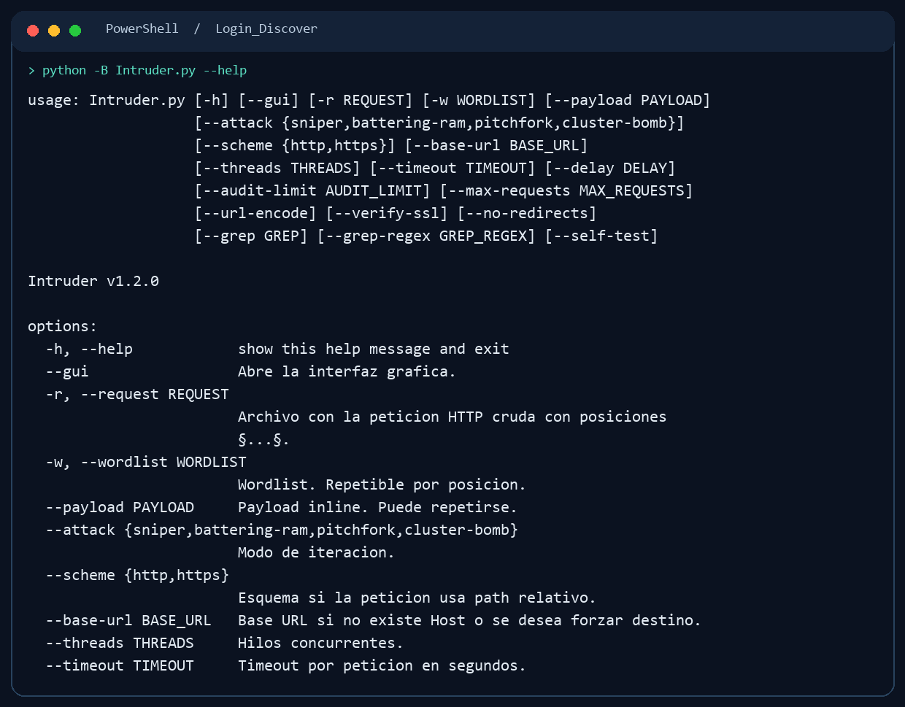

# Login Discover

  

**Descubrimiento de superficies de autenticación y prueba controlada de formularios HTTP.** `main.py` ofrece una interfaz gráfica para localizar paneles de acceso; `Intruder.py` reproduce peticiones crudas con posiciones de payload, límites de solicitudes y comparación de respuestas. Ayuda a documentar controles de acceso, rate limiting y diferencias de respuesta durante una auditoría.



## Instalación

Requiere Python 3.11 o superior. La interfaz gráfica necesita un escritorio Windows o Linux; Playwright necesita su navegador Chromium.

```powershell
git clone https://github.com/RogerF5-Security/Login_Discover.git
cd Login_Discover
python -m venv .venv
.\.venv\Scripts\Activate.ps1
python -m pip install -r requirements.txt
python -m playwright install chromium
```

En Linux usa `source .venv/bin/activate` y `python3` si corresponde.

## Uso

```powershell
python main.py                 # Interfaz de descubrimiento
python Intruder.py --gui       # Interfaz de peticiones
python Intruder.py --help      # Parámetros de consola
python main.py --self-test     # Comprobación local, sin red
python Intruder.py --self-test # Comprobación local, sin red
```

Para una petición de laboratorio, crea `request.txt` con marcadores `§...§` y usa una lista de valores propia:

```http
POST /login HTTP/1.1
Host: localhost:8000
Content-Type: application/x-www-form-urlencoded

username=§usuario_demo§&password=§clave_demo§
```

```powershell
python Intruder.py -r request.txt -w .\wordlists\users_default.txt --attack sniper --max-requests 10 --delay 0.3 --grep "Invalid"
```

Los archivos `targets.txt` y `login.txt` son entradas locales vacías. Los resultados y peticiones reales deben quedar fuera del repositorio. Revisa `--help` antes de ejecutar pruebas sobre un entorno.

## Alcance y licencia

Este repositorio no declara todavía una licencia de reutilización. El uso de la herramienta se limita a entornos controlados y auditorías con autorización expresa del titular del sistema. Define alcance, volumen y horarios de las pruebas antes de enviar tráfico.
